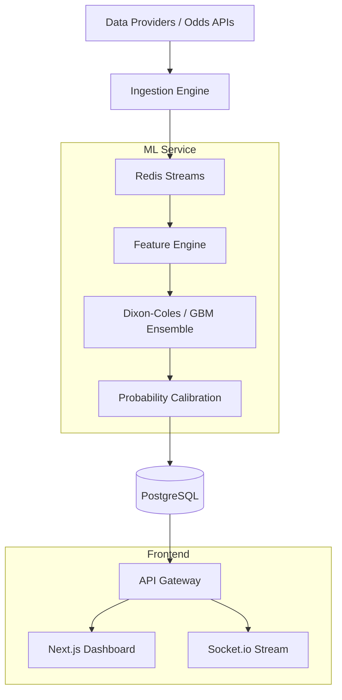

# System Architecture

## Overview
The platform is built as a modular monorepo using Turborepo, ensuring strict type safety and code sharing across services. It utilizes an event-driven architecture to handle high-concurrency real-time data ingestion and prediction delivery.

## Component Layout

### 1. API Gateway (`apps/api`)
- **Technology**: Node.js / Express / TypeScript.
- **Role**: Orchestrates requests, manages authentication (NextAuth.js), and handles real-time broadcasting via Socket.io.
- **Data Access**: Prisma ORM for PostgreSQL.
- **Caching**: Redis Cluster for high-speed prediction and market snapshot retrieval.

### 2. ML Service (`services/ml`)
- **Technology**: Python / FastAPI / Scikit-Learn / XGBoost.
- **Role**: Performs heavy-duty statistical modeling and inference.
- **Models**:
    - **Baseline**: Dixon-Coles Poisson model.
    - **Ensemble**: Gradient Boosting (XGBoost) for non-linear patterns.
    - **Calibration**: Isotonic Regression for true probability mapping.
- **Observability**: Prometheus metrics for inference latency and drift.

### 3. Web Dashboard (`apps/web`)
- **Technology**: Next.js / React / Tailwind CSS.
- **Role**: Institutional dashboard for portfolio management, performance tracking, and live intelligence.
- **Visualization**: Recharts for interactive ROI and drawdown analysis.

### 4. Shared Database (`packages/database`)
- **Technology**: PostgreSQL / Prisma Schema.
- **Role**: Single source of truth for fixtures, predictions, portfolios, and audit snapshots.

## Data Flow Diagram

## Inter-Service Communication
- **Synchronous**: REST APIs for administrative tasks and health checks.
- **Asynchronous**: Redis Streams for high-throughput prediction pipelines.
- **Real-time**: WebSockets for pushing live odds and prediction updates to the frontend.
